<p align="center">
  <picture>
    
  </picture>
</p>

<h1 align="center">Engram — The Autonomous Memory Dashboard</h1>

<p align="center">
  <em>A self-organizing memory layer that knows what to remember, what to reconcile, and when to forget.</em>
</p>

<p align="center">
  <a href="LICENSE"></a>
  <a href="https://github.com/Aditya060806/Engram/actions/workflows/ci.yml"></a>
  <a href="CONTRIBUTING.md"></a>
  <a href="https://engram1002.vercel.app"></a>
</p>

<p align="center">
  
  
  
  
  
  
  
</p>

<p align="center">
  <b><a href="https://engram1002.vercel.app">▶ Live Demo</a></b> &nbsp;•&nbsp;
  <b>Built by <a href="https://github.com/Aditya060806">Aditya Pandey</a></b>
</p>

---

## Table of Contents

- [At a Glance](#at-a-glance)
- [Proof by the Numbers](#proof-by-the-numbers)
- [Quick Access](#quick-access)
- [1. The Problem & Potential Impact](#1-the-problem--potential-impact)
- [2. Why Engram Is Different](#2-why-engram-is-different)
- [3. Hackathon Submission & Judging Criteria](#3-hackathon-submission--judging-criteria)
  - [3.1 Two Tracks, One Codebase](#31-two-tracks-one-codebase)
- [4. Feature Tour](#4-feature-tour)
- [5. System Architecture](#5-system-architecture)
- [6. Core Architecture and Memory Lifecycle](#6-core-architecture-and-memory-lifecycle)
- [7. Request Sequences](#7-request-sequences)
- [8. Cognee API Mapping](#8-cognee-api-mapping)
  - [8.1 Verifying the lifecycle end-to-end](#81-verifying-the-lifecycle-end-to-end)
  - [8.2 Schema-guided (typed) extraction](#82-schema-guided-typed-extraction)
- [9. Data Model](#9-data-model)
- [10. Key Features](#10-key-features)
- [11. The Math: Confidence, Decay, and Reconciliation](#11-the-math-confidence-decay-and-reconciliation)
- [12. API Reference](#12-api-reference)
- [13. Comparison With Other Memory Approaches](#13-comparison-with-other-memory-approaches)
- [14. Technical Stack](#14-technical-stack)
  - [14.1 Performance & Latency](#141-performance--latency)
- [15. Project Structure](#15-project-structure)
- [16. Local Setup](#16-local-setup)
- [17. Deployment](#17-deployment)
- [18. Environment Variables Reference](#18-environment-variables-reference)
- [19. Security Model](#19-security-model)
- [20. Known Limitations](#20-known-limitations)
- [21. Roadmap](#21-roadmap)
- [22. FAQ](#22-faq)
- [Contributing](#contributing)
- [Author](#author)

---

## At a Glance

> **Engram is a self-organizing memory layers dashboard built on Cognee to handle dynamic context updates, contradiction management, and automatic memory decay.**

| | |
|---|---|
| **What it is** | A dashboard that turns raw context (repos, PDFs, articles, chat exports, YouTube, free-text notes) into a living knowledge graph that reconciles contradictions and forgets stale facts on its own. |
| **The one-liner** | Most memory tools only *append and recall*. Engram also *decides what still deserves trust*. |
| **Cognee usage** | The full lifecycle — `remember` / `recall` / `improve` / `forget` — is load-bearing, wired to **both the local SDK and a hosted Cognee Cloud tenant**, and verified end to end. Qualifies for **both** tracks (see [3.1 Two Tracks, One Codebase](#31-two-tracks-one-codebase)). |
| **Stack** | Next.js 16 + React 19 + Tailwind v4 frontend, FastAPI + Cognee backend, SQLite locally / PostgreSQL + PGVector in production. |
| **Built for** | The Hangover Part AI: Where is My Context? — WeMakeDevs x Cognee Hackathon (Jun 29 - Jul 5, 2026). |

*AI coding assistants were used in the development of Engram, in accordance with the WeMakeDevs × Cognee Hackathon guidelines.*

---

## Proof by the Numbers

These are verifiable metrics drawn straight from the codebase, not marketing claims. Each maps to a file or feature you can open and check.

| Metric | Value | Evidence |
|---|:---:|---|
| Measured recall served by Cognee | **10 / 10 (100%)** | Live-tenant benchmark, [§ measured recall routing](#measured-recall-routing-live-tenant) |
| Cognee lifecycle operations used | **4 / 4** | `remember` · `recall` · `improve` · `forget` — all load-bearing ([services/__init__.py](https://github.com/Aditya060806/Engram/blob/main/backend/services/__init__.py)) |
| Cognee integration paths | **2** | Local SDK **and** hosted Cognee Cloud REST tenant ([cognee_cloud.py](https://github.com/Aditya060806/Engram/blob/main/backend/cognee_cloud.py)) |
| Typed ontology extraction | **5 node types + typed edges** | `graph_model` + custom prompt steer `remember()` ([§8.2](#82-schema-guided-typed-extraction)) |
| Contradiction detection | **graph-derived** | `reconcile_from_graph()` reads `supersedes`/`contradicts` edges from Cognee ([§10.1](#101-the-reconciliation-engine)) |
| End-to-end lifecycle test checks | **6 / 6 PASS** | [test_cognee_cloud.py](https://github.com/Aditya060806/Engram/blob/main/backend/test_cognee_cloud.py) |
| CI checks | **ruff · eslint · build · pytest** | [.github/workflows/ci.yml](https://github.com/Aditya060806/Engram/blob/main/.github/workflows/ci.yml) |
| Ingestion source types | **6** | pdf · github · article · youtube · conversation · text |
| Backend API endpoints | **40** | [§12 API Reference](#12-api-reference) |
| Measured warm recall latency (p50) | **~8 s** | Cognee graph-completion, live tenant ([§14.1](#141-performance--latency)) |
| MCP tools exposed to agents | **6** | read + write: recall · graph · review · remember · improve · forget ([mcp_server.py](https://github.com/Aditya060806/Engram/blob/main/backend/mcp_server.py)) |
| Frontend UI routes | **9** | landing · ask · graph · resolve · ingest · recap · provenance · settings · login |
| Reusable React components | **18** | [`frontend/src/components/`](https://github.com/Aditya060806/Engram/tree/main/frontend/src/components) |
| Lines of code | **~12.8k** | ~5.2k Python (backend) + ~7.6k TypeScript (frontend) |
| Storage engines supported | **2** | SQLite (local) + PostgreSQL/PGVector (prod) |
| Memory states modeled | **7** | Active · Reinforced · Contested · Superseded · Decaying · Forgotten · New |
| Reconciliation outcomes | **3** | keep new · keep old · keep both |
| Rate-limited sensitive routes | **6** | ingest · recall · improve · recap · ai/models · ai/config |
| Architecture diagrams in this README | **15** | rendered Mermaid (flowchart, sequence, state, ER, charts) |
| Latency optimization layers | **5** | pooled Cognee client · backend cache · client cache+dedupe · prewarm · async ingest ([§14.1](#141-performance--latency)) |

### Cognee lifecycle coverage vs. typical hackathon builds

Most "memory" submissions wire up one or two Cognee calls (usually `remember` + `recall`). Engram uses the entire lifecycle and makes each operation user-visible.

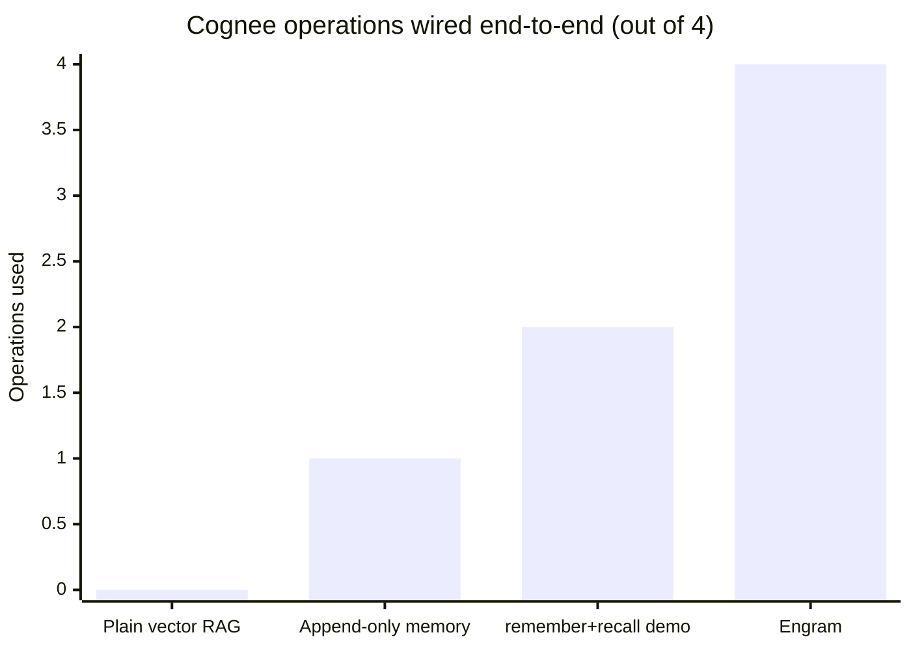
```mermaid
xychart-beta
    title "Cognee operations wired end-to-end (out of 4)"
    x-axis ["Plain vector RAG", "Append-only memory", "remember+recall demo", "Engram"]
    y-axis "Operations used" 0 --> 4
    bar [0, 1, 2, 4]
```

### Capability coverage score

Counting the capabilities from the comparison matrix in [§2](#2-why-engram-is-different), Engram satisfies **10 of 10** while common approaches cover far fewer.

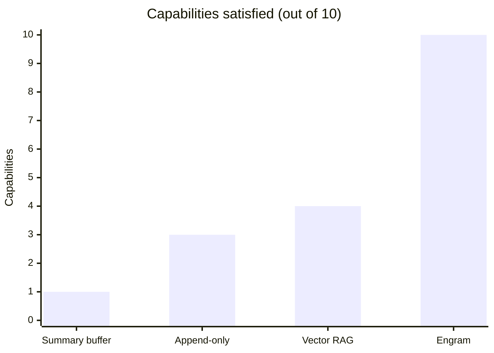
```mermaid
xychart-beta
    title "Capabilities satisfied (out of 10)"
    x-axis ["Summary buffer", "Append-only", "Vector RAG", "Engram"]
    y-axis "Capabilities" 0 --> 10
    bar [1, 3, 4, 10]
```

### Measured recall routing (live tenant)

Recall is Cognee-first: the graph answers directly whenever it can, and an LLM only fills gaps. This is **measured**, not aspirational. Running [`benchmark_recall.py`](https://github.com/Aditya060806/Engram/blob/main/backend/benchmark_recall.py) against the live Cognee Cloud tenant on 2026-07-03 (ingest a known corpus, wait for the graph, run 10 queries, read the `provider` tag on each answer):

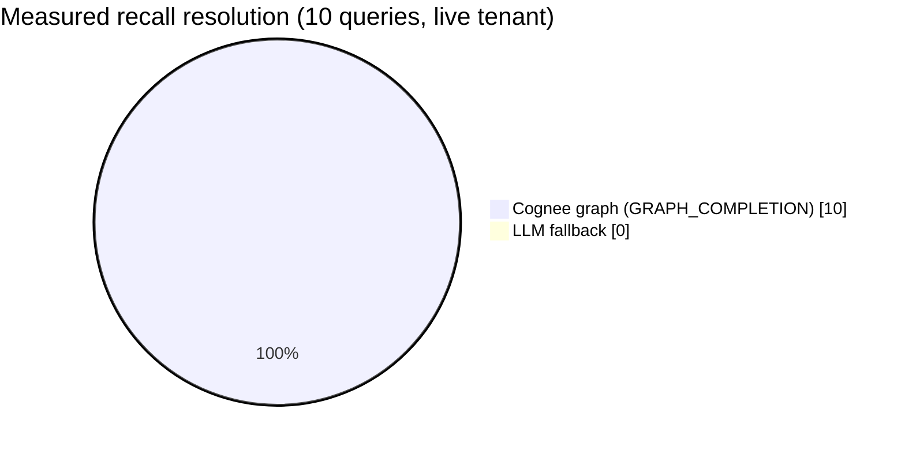
```mermaid
pie showData
    title Measured recall resolution (10 queries, live tenant)
    "Cognee graph (GRAPH_COMPLETION)" : 10
    "LLM fallback" : 0
```

- **Cognee-served: 10/10 (100%)** — every answer returned `provider=cognee model=graph-completion`
- LLM fallback: 0/10 (0%)

| Query | Provider | Model |
|---|---|---|
| Who is the groom and when is the wedding? | cognee | graph-completion |
| What database do we use now? | cognee | graph-completion |
| What database did we use before? | cognee | graph-completion |
| What changed about our deploy process? | cognee | graph-completion |
| What does Engram use for its memory lifecycle? | cognee | graph-completion |
| Is Stu the groom? | cognee | graph-completion |
| When did we switch database? | cognee | graph-completion |
| Summarize the current architecture decisions. | cognee | graph-completion |
| What is the wedding location? | cognee | graph-completion |
| Which memory operations does Cognee provide? | cognee | graph-completion |

> Reproduce it yourself: `python backend/benchmark_recall.py --url <backend-url>`. The script writes this table to `backend/benchmark_results.md`.

### Live production status

The backend exposes its routing state at the root endpoint, so anyone can confirm the hosted Cognee Cloud tenant is active (not a local mock). Hitting the live backend returns:

```json
{
  "service": "engram-cognee",
  "status": "ok",
  "cognee": {
    "cloud_enabled": true,
    "cloud_connected": true,
    "local_sdk_ready": true,
    "missing_cloud_env": [],
    "recall_source": "cognee-cloud"
  }
}
```

| Signal | Value | Meaning |
|---|:---:|---|
| `cloud_enabled` | `true` | Both Cognee Cloud credentials are configured in production |
| `cloud_connected` | `true` | Startup health check reached the tenant successfully |
| `recall_source` | `cognee-cloud` | Recall routes to the Cognee graph first, verified live |

This is backed by a dedicated diagnostic path (`cognee_status()`), and a companion `GET /cognee/graph-status` endpoint powers the live "graph is building" indicator shown on the ingest screen while the tenant finishes `cognify`.

---

## Quick Access

**Live demo:** [https://engram1002.vercel.app](https://engram1002.vercel.app)

Sign in with GitHub or Google to access the full experience — your knowledge graph and conversations are saved to your account. A **"View demo without signing in"** link is available on the login page for judges and exploration of seed data. For AI features (querying, ingestion, memory reconciliation), click **"Configure AI"** in Settings and bring your own API key after signing in.

---

## 1. The Problem & Potential Impact

As Large Language Models (LLMs) ingest more context over time, they encounter a critical issue: **semantic drift and contradiction**. Real-world context is dynamic—credentials get rotated, tech stacks evolve, and architectural design decisions update. Most memory tools simply append new information, leading to conflicting records, bloated contexts, and retrieval failures where the LLM confidently retrieves stale facts.

Engram solves this by providing a **self-reconciling memory dashboard**. By detecting semantic contradictions at ingestion time and offering an intuitive reconciliation workflow, Engram ensures the underlying memory store contains only active, verified, and high-confidence facts. The potential impact is huge: eliminating the cost, hallucination, and logic bugs associated with LLMs acting on stale or contradicted knowledge.

### The failure mode, visualized

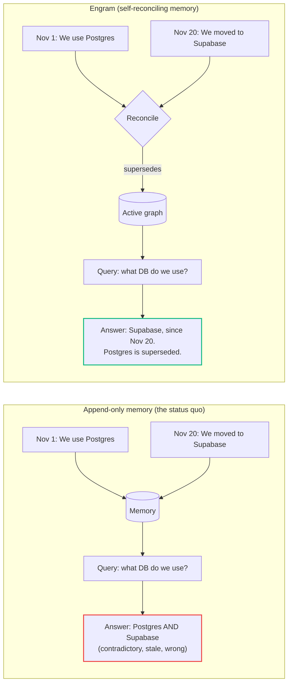
```mermaid
flowchart LR
    subgraph Naive["Append-only memory (the status quo)"]
        direction TB
        A1["Nov 1: We use Postgres"] --> A3[(Memory)]
        A2["Nov 20: We moved to Supabase"] --> A3
        A3 --> A4["Query: what DB do we use?"]
        A4 --> A5["Answer: Postgres AND Supabase\n(contradictory, stale, wrong)"]
    end
    subgraph Engram["Engram (self-reconciling memory)"]
        direction TB
        B1["Nov 1: We use Postgres"] --> B3{Reconcile}
        B2["Nov 20: We moved to Supabase"] --> B3
        B3 -->|supersedes| B4[(Active graph)]
        B4 --> B5["Query: what DB do we use?"]
        B5 --> B6["Answer: Supabase, since Nov 20.\nPostgres is superseded."]
    end
    style A5 stroke:#ef4444,stroke-width:2px
    style B6 stroke:#10b981,stroke-width:2px
```

---

## 2. Why Engram Is Different

Most "memory for AI" projects stop at *store and retrieve*. Engram treats memory as a **lifecycle** with an opinion about truth over time.

| Capability | Vector-store RAG | Append-only memory | **Engram** |
|---|:---:|:---:|:---:|
| Ingest mixed sources (repo, PDF, article, chat, video, note) | Partial | Partial | ✅ Full |
| Semantic recall | ✅ | ✅ | ✅ (graph-grounded) |
| Detects contradictions at ingest | ❌ | ❌ | ✅ |
| Human-in-the-loop reconciliation (keep new / old / both) | ❌ | ❌ | ✅ |
| Confidence scoring per fact | ❌ | Rare | ✅ |
| Automatic decay + forget of stale facts | ❌ | ❌ | ✅ |
| Temporal "what changed since X?" diffs | ❌ | ❌ | ✅ |
| Provenance + schema inventory views | Rare | ❌ | ✅ |
| Typed ontology extraction (not generic chunks) | ❌ | ❌ | ✅ `graph_model` + custom prompt |
| Uses the full Cognee lifecycle | n/a | n/a | ✅ `remember`/`recall`/`improve`/`forget` |

---

## 3. Hackathon Submission & Judging Criteria

| Criterion | Where to look |
|---|---|
| **Potential Impact** | [The Problem & Potential Impact](#1-the-problem--potential-impact) — acting on stale/contradicted knowledge is a real, recurring cost this directly addresses |
| **Creativity & Innovation** | [The Reconciliation Engine](#101-the-reconciliation-engine) + "What Changed?" diff query — most memory tools stop at recall; this one decides what still deserves trust |
| **Technical Excellence** | [Core Architecture & Memory Lifecycle](#6-core-architecture-and-memory-lifecycle) + [Cognee API Mapping](#8-cognee-api-mapping) below |
| **Best Use of Cognee** | Full lifecycle usage — `remember`/`recall`/`improve`/`forget` are all load-bearing, wired to **both the local SDK and a hosted Cognee Cloud tenant** (REST), with **schema-guided typed extraction** ([8.2](#82-schema-guided-typed-extraction)), and verified end-to-end by [`test_cognee_cloud.py`](#81-verifying-the-lifecycle-end-to-end) |
| **User Experience** | The [Product walkthrough](#product-walkthrough) screenshots + a live "graph is building" indicator, animated landing, and the interactive `/ask` and `/resolve` flows |
| **Presentation Quality** | The WeMakeDevs project submission page + this comprehensive README |

### 3.1 Two Tracks, One Codebase

Engram is built for **both** hackathon tracks, and the same lifecycle logic powers each. It is not two projects bolted together: there is one memory model with two interchangeable Cognee backends, chosen at runtime.

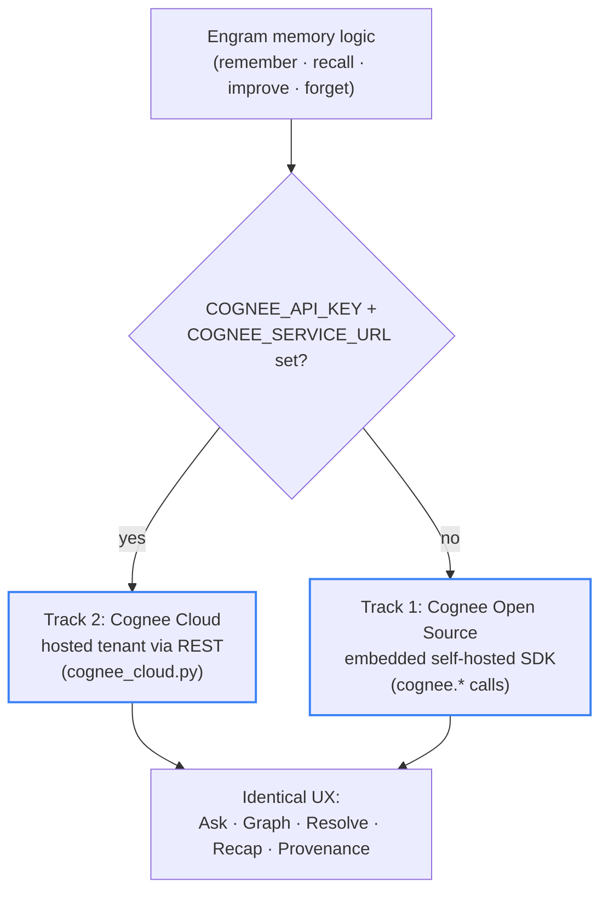
```mermaid
flowchart TB
    App["Engram memory logic\n(remember · recall · improve · forget)"]
    App --> Router{"COGNEE_API_KEY +\nCOGNEE_SERVICE_URL set?"}
    Router -->|"yes"| Cloud["Track 2: Cognee Cloud\nhosted tenant via REST\n(cognee_cloud.py)"]
    Router -->|"no"| OSS["Track 1: Cognee Open Source\nembedded self-hosted SDK\n(cognee.* calls)"]
    Cloud --> Same["Identical UX:\nAsk · Graph · Resolve · Recap · Provenance"]
    OSS --> Same
    classDef c stroke:#3b82f6,stroke-width:2px;
    class Cloud,OSS c;
```

| | **Track 1: Best Use of Cognee Open Source** | **Track 2: Best Use of Cognee Cloud** |
|---|---|---|
| **How it runs** | Embedded `cognee` SDK, self-hosted | Hosted Cognee Cloud tenant over REST |
| **Where** | [`services/__init__.py`](https://github.com/Aditya060806/Engram/blob/main/backend/services/__init__.py) | [`cognee_cloud.py`](https://github.com/Aditya060806/Engram/blob/main/backend/cognee_cloud.py) |
| **Lifecycle** | `cognee.remember / cognify / memify / recall / forget` | `add_text → cognify`, `recall`, `cognify` (improve), `forget` |
| **Beyond the basics** | `visualize_memory_provenance`, `get_schema_inventory`, `session.get_session / distill_session / add_feedback`, `run_migrations`, self-hosted relational + vector + graph store config | datasets, dataset graph, schema inventory, provenance HTML, per-tenant isolation |
| **Proof it works** | Runs the whole app with cloud vars unset; `/` reports `recall_source: local-sdk` | Live deploy: `recall_source: cognee-cloud`, [10/10 measured recalls](#measured-recall-routing-live-tenant), [6/6 lifecycle test](#81-verifying-the-lifecycle-end-to-end) |

**Demonstrate each track in one command each:**

```bash
# Track 2 — Cognee Cloud (the live deploy runs this way)
#   set COGNEE_API_KEY + COGNEE_SERVICE_URL (+ COGNEE_TENANT_ID), then:
python -m uvicorn main:app --port 8000
#   GET / -> "recall_source": "cognee-cloud"

# Track 1 — Cognee Open Source (self-hosted SDK, no cloud vars)
#   leave COGNEE_API_KEY / COGNEE_SERVICE_URL unset, then:
python -m uvicorn main:app --port 8000
#   GET / -> "recall_source": "local-sdk"
```

Same endpoints, same UI, same reconciliation and decay behavior. Only the Cognee backend changes.

---

## 4. Feature Tour

| View | Route | What it does |
|---|---|---|
| **Landing** | `/` | Animated explainer of the memory lifecycle, live reconciliation demo, and an interactive "Ask Engram" widget. |
| **Ask** | `/ask` | Graph-grounded, time-aware chat. Answers cite sources, render diff cards, timelines, and connection maps. |
| **Graph** | `/graph` | Interactive 3D/2D force-directed knowledge graph with confidence-weighted nodes and typed edges. |
| **Resolve** | `/resolve` | The "What Changed?" inbox where detected contradictions are reconciled (keep new / old / both). |
| **Ingest** | `/ingest` | Add a GitHub repo, PDF, article URL, YouTube video, chat export, or a free-text note. |
| **Recap** | `/recap` | The "Where's My Context?" morning-after digest for a 7 / 30 / 90 day window. |
| **Provenance** | `/provenance` | Cognee-generated provenance visualization of how memory was built. |
| **Settings** | `/settings` | Bring-your-own-key setup, model discovery, decay tuning, and enrichment controls. |

### Product walkthrough

<p align="center">
  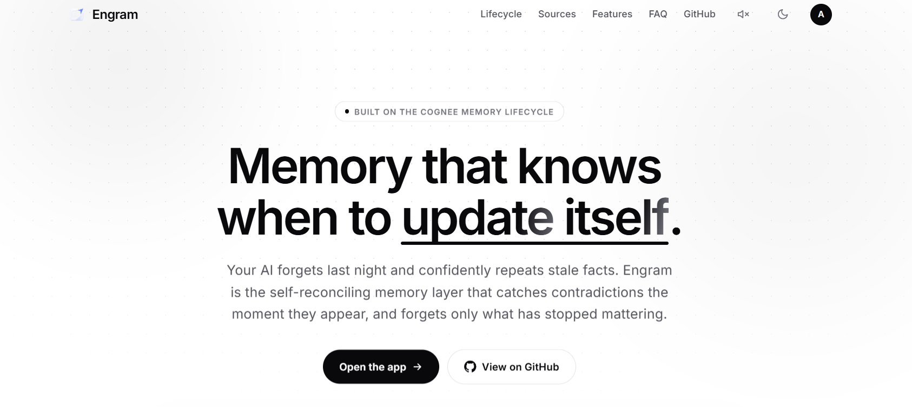
</p>

<p align="center">
  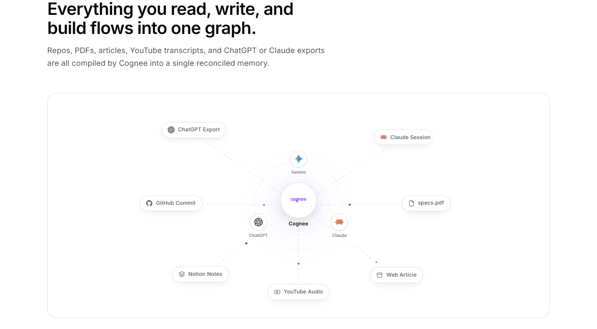
  &nbsp;
  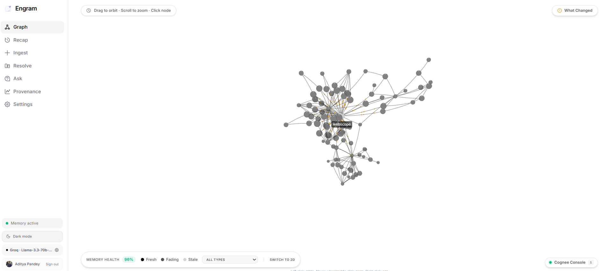
</p>

<p align="center">
  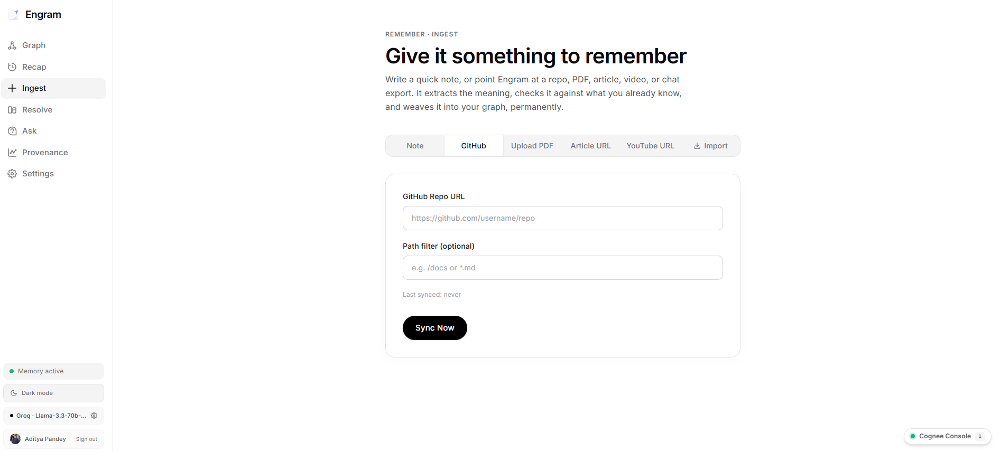
  &nbsp;
  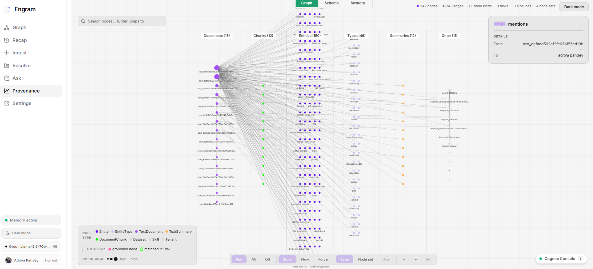
</p>

---

## 5. System Architecture

Engram is a clean two-tier system. The Next.js app never talks to the LLM or Cognee directly — every backend call is funneled through an authenticated proxy that injects the shared access key and the per-user id.

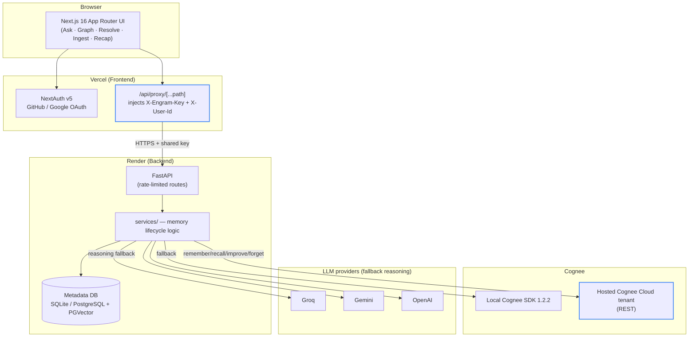
```mermaid
flowchart TB
    subgraph Client["Browser"]
        UI["Next.js 16 App Router UI\n(Ask · Graph · Resolve · Ingest · Recap)"]
    end

    subgraph Vercel["Vercel (Frontend)"]
        direction TB
        Auth["NextAuth v5\nGitHub / Google OAuth"]
        Proxy["/api/proxy/[...path]\ninjects X-Engram-Key + X-User-Id"]
        UI --> Auth
        UI --> Proxy
    end

    subgraph Render["Render (Backend)"]
        direction TB
        API["FastAPI\n(rate-limited routes)"]
        SVC["services/ — memory lifecycle logic"]
        DB[("Metadata DB\nSQLite / PostgreSQL + PGVector")]
        API --> SVC
        SVC --> DB
    end

    subgraph Memory["Cognee"]
        SDK["Local Cognee SDK 1.2.2"]
        Cloud["Hosted Cognee Cloud tenant\n(REST)"]
    end

    subgraph LLM["LLM providers (fallback reasoning)"]
        Groq["Groq"]
        Gemini["Gemini"]
        OpenAI["OpenAI"]
    end

    Proxy -->|HTTPS + shared key| API
    SVC -->|remember/recall/improve/forget| Cloud
    SVC -->|fallback| SDK
    SVC -->|reasoning fallback| Groq
    SVC --> Gemini
    SVC --> OpenAI

    classDef c stroke:#3b82f6,stroke-width:2px;
    class Cloud,Proxy c;
```

### Deployment topology

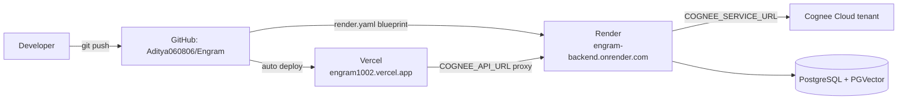
```mermaid
flowchart LR
    Dev["Developer"] -->|git push| GH["GitHub: Aditya060806/Engram"]
    GH -->|auto deploy| V["Vercel\nengram1002.vercel.app"]
    GH -->|render.yaml blueprint| R["Render\nengram-backend.onrender.com"]
    V -->|COGNEE_API_URL proxy| R
    R -->|COGNEE_SERVICE_URL| CC["Cognee Cloud tenant"]
    R --> PG[("PostgreSQL + PGVector")]
```

---

## 6. Core Architecture and Memory Lifecycle

The following flow illustrates how Engram manages the ingestion, contradiction resolution, query recall, and automated decay of dynamic memory:

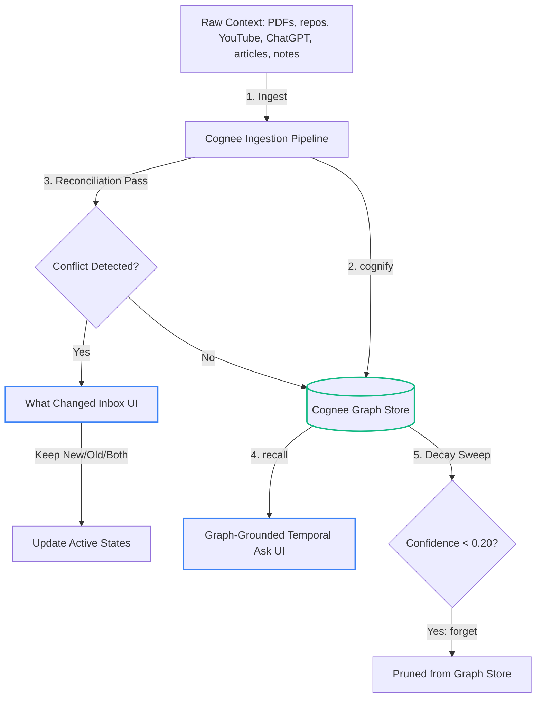
```mermaid
graph TD
    classDef highlight stroke:#3b82f6,stroke-width:2px;
    classDef database stroke:#10b981,stroke-width:2px;
    
    Raw[Raw Context: PDFs, repos, YouTube, ChatGPT, articles, notes] -->|1. Ingest| Ingestion[Cognee Ingestion Pipeline]
    Ingestion -->|2. cognify| GraphDb[(Cognee Graph Store)]:::database
    Ingestion -->|3. Reconciliation Pass| ContradictionJudge{Conflict Detected?}
    
    ContradictionJudge -->|Yes| ConflictInbox[What Changed Inbox UI]:::highlight
    ContradictionJudge -->|No| GraphDb
    
    ConflictInbox -->|Keep New/Old/Both| ResolveAction[Update Active States]
    GraphDb -->|4. recall| AskChat[Graph-Grounded Temporal Ask UI]:::highlight
    
    GraphDb -->|5. Decay Sweep| Degradation{Confidence < 0.20?}
    Degradation -->|Yes: forget| ForgetAction[Pruned from Graph Store]
```

### The lifecycle as a state machine

Each fact (graph node) moves through a well-defined set of states from first ingest to eventual pruning.

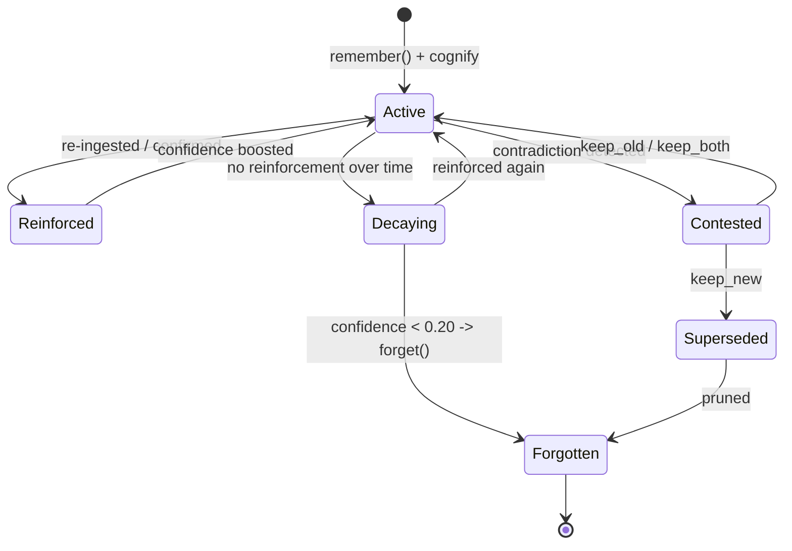
```mermaid
stateDiagram-v2
    [*] --> Active: remember() + cognify
    Active --> Reinforced: re-ingested / confirmed
    Reinforced --> Active: confidence boosted
    Active --> Contested: contradiction detected
    Contested --> Active: keep_old / keep_both
    Contested --> Superseded: keep_new
    Active --> Decaying: no reinforcement over time
    Decaying --> Active: reinforced again
    Decaying --> Forgotten: confidence < 0.20 -> forget()
    Superseded --> Forgotten: pruned
    Forgotten --> [*]
```

---

## 7. Request Sequences

### Ingest + reconcile

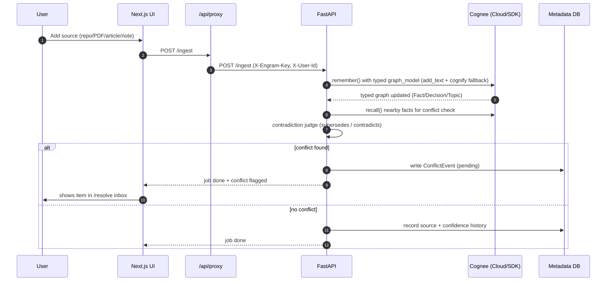
```mermaid
sequenceDiagram
    autonumber
    participant U as User
    participant FE as Next.js UI
    participant PX as /api/proxy
    participant API as FastAPI
    participant CG as Cognee (Cloud/SDK)
    participant DB as Metadata DB

    U->>FE: Add source (repo/PDF/article/note)
    FE->>PX: POST /ingest
    PX->>API: POST /ingest (X-Engram-Key, X-User-Id)
    API->>CG: remember() with typed graph_model (add_text + cognify fallback)
    CG-->>API: typed graph updated (Fact/Decision/Topic)
    API->>CG: recall() nearby facts for conflict check
    API->>API: contradiction judge (supersedes / contradicts)
    alt conflict found
        API->>DB: write ConflictEvent (pending)
        API-->>FE: job done + conflict flagged
        FE->>U: shows item in /resolve inbox
    else no conflict
        API->>DB: record source + confidence history
        API-->>FE: job done
    end
```

### Graph-grounded recall

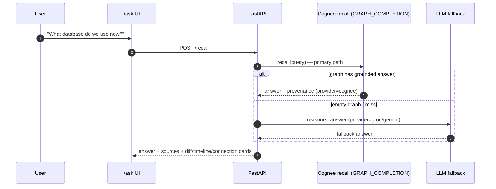
```mermaid
sequenceDiagram
    autonumber
    participant U as User
    participant FE as /ask UI
    participant API as FastAPI
    participant CG as Cognee recall (GRAPH_COMPLETION)
    participant LLM as LLM fallback

    U->>FE: "What database do we use now?"
    FE->>API: POST /recall
    API->>CG: recall(query) — primary path
    alt graph has grounded answer
        CG-->>API: answer + provenance (provider=cognee)
    else empty graph / miss
        API->>LLM: reasoned answer (provider=groq/gemini)
        LLM-->>API: fallback answer
    end
    API-->>FE: answer + sources + diff/timeline/connection cards
```

---

## 8. Cognee API Mapping

Engram uses Cognee two ways, both load-bearing: the **local Python SDK** (embedded) and, when configured, a **hosted Cognee Cloud tenant** over its REST API (`cognee.serve()`-style routing implemented directly against the tenant endpoints). All four lifecycle operations prefer the hosted tenant when connected and fall back to the local SDK/metadata store otherwise.

| Cognee Operation | Local SDK call | Hosted-tenant REST endpoint | Engram feature |
|---|---|---|---|
| `remember()` | `cognee.remember(...)` | `POST /api/v1/remember` (typed) → `add_text` + `cognify` (fallback) | Ingests GitHub repos, PDFs, ChatGPT/Claude exports, articles, YouTube transcripts, free-text notes + chat-turn memory, with a typed ontology (see [8.2](#82-schema-guided-typed-extraction)) |
| `recall()` | `cognee.recall(...)` | `POST /api/v1/recall` | Graph-grounded, time-aware chat queries ("what did I believe before vs now") + the `/recap` narrative |
| `improve()` / memify | `cognee.memify(...)` / `cognify()` | `POST /api/v1/cognify` (re-enrichment) | Post-ingestion enrichment + the "Run enrichment" action in Settings |
| `forget()` | `cognee.forget(...)` | `POST /api/v1/forget` | Source-level pruning and automatic confidence-decay sweeps |
| graph / schema / provenance | `get_memory_provenance_graph`, `get_schema_inventory` | `GET /datasets/{id}/graph`, `GET /schema/inventory`, `GET /schema/provenance` | The 3D graph, schema inventory, and provenance views |

Core wiring lives in [`services/__init__.py`](https://github.com/Aditya060806/Engram/blob/main/backend/services/__init__.py) and the tenant REST client in [`cognee_cloud.py`](https://github.com/Aditya060806/Engram/blob/main/backend/cognee_cloud.py).

> **Cognee-first by design.** Recall prefers the Cognee `GRAPH_COMPLETION` path and only falls back to an LLM provider when the graph has no grounded answer (for example, an empty graph on a fresh deploy). Answers surface their origin as `provider=cognee model=graph-completion` when served from the graph.

### 8.1 Verifying the lifecycle end-to-end

[`backend/test_cognee_cloud.py`](https://github.com/Aditya060806/Engram/blob/main/backend/test_cognee_cloud.py) exercises all four operations against a live tenant on a throwaway dataset and prints PASS/FAIL per op:

```text
=== Cognee Cloud live lifecycle test ===
PASS  connectivity + API key (GET /health)
PASS  dataset ready
PASS  remember() — add_text + cognify built the graph
PASS  recall() — got an answer from the graph
      ↳ The groom is Doug, and the wedding is scheduled for Sunday.
PASS  improve() — re-enrichment queued on tenant
PASS  forget() — dataset pruned from tenant
```

That `recall()` line is the hackathon prompt itself — ingest "Doug is the groom… the wedding is Sunday," then answer *"Where is Doug?"* across a fresh query, straight from the Cognee-built graph.

### 8.2 Schema-guided (typed) extraction

Ingestion does not settle for generic chunks. Engram hands Cognee Cloud `remember()` a **typed ontology** (`graph_model`, a JSON Schema) plus a **custom extraction prompt** ([graph_model.py](https://github.com/Aditya060806/Engram/blob/main/backend/graph_model.py)), so the graph is built from Engram's own domain types, `Source`, `Topic`, `Entity`, `Fact`, and `Decision`, with typed edges including `supersedes` and `contradicts`. Those two edges are the backbone of the reconciliation and decay story: they let the graph itself express "this replaced that" rather than leaving it implicit.

This is verified live: ingesting a supersession scenario ("chose Postgres, then switched to Supabase, which supersedes the earlier decision") into a throwaway tenant dataset produced typed `Decision`, `Topic`, and `Entity` nodes, not opaque chunks. If a tenant ever rejects the graph model, ingestion transparently falls back to the proven `add_text` plus `cognify` path, so extraction is strictly an upgrade with no regression risk.

---

## 9. Data Model

Engram keeps a lightweight relational metadata layer alongside the Cognee graph. The metadata store tracks sources, contradictions, the reconciliation audit trail, confidence history, decay settings, and encrypted BYOK config. The rich semantic graph itself lives in Cognee, and it is **typed**: ingestion steers `remember()` with a `graph_model` so the graph is built from `Source`, `Topic`, `Entity`, `Fact`, and `Decision` nodes with `supersedes` and `contradicts` edges rather than generic chunks (see [8.2](#82-schema-guided-typed-extraction)).

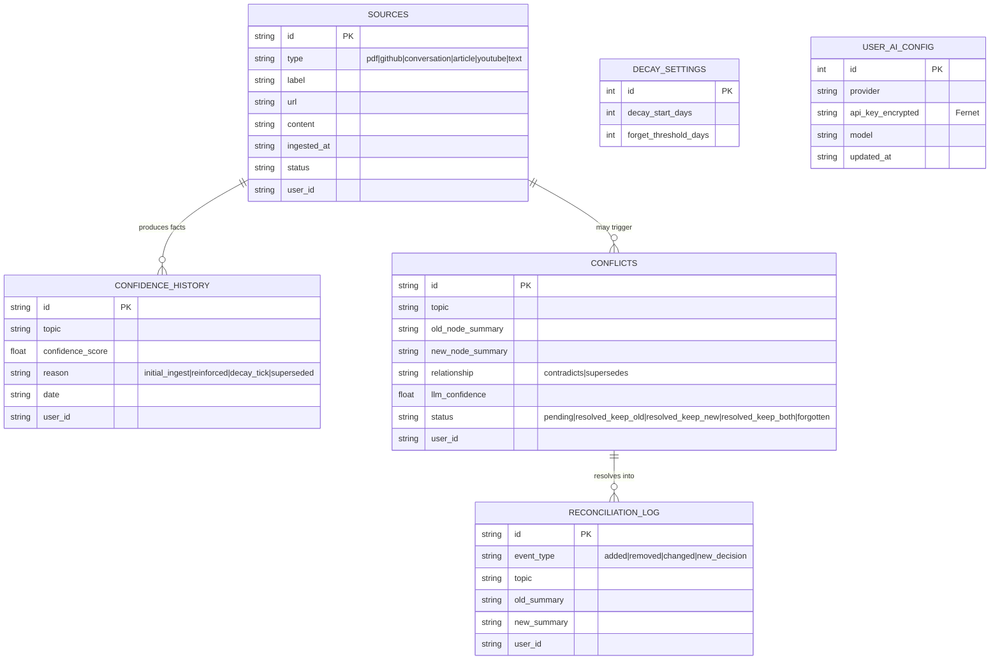
```mermaid
erDiagram
    SOURCES ||--o{ CONFIDENCE_HISTORY : "produces facts"
    SOURCES ||--o{ CONFLICTS : "may trigger"
    CONFLICTS ||--o{ RECONCILIATION_LOG : "resolves into"
    SOURCES {
        string id PK
        string type "pdf|github|conversation|article|youtube|text"
        string label
        string url
        string content
        string ingested_at
        string status
        string user_id
    }
    CONFLICTS {
        string id PK
        string topic
        string old_node_summary
        string new_node_summary
        string relationship "contradicts|supersedes"
        float  llm_confidence
        string status "pending|resolved_keep_old|resolved_keep_new|resolved_keep_both|forgotten"
        string user_id
    }
    RECONCILIATION_LOG {
        string id PK
        string event_type "added|removed|changed|new_decision"
        string topic
        string old_summary
        string new_summary
        string user_id
    }
    CONFIDENCE_HISTORY {
        string id PK
        string topic
        float  confidence_score
        string reason "initial_ingest|reinforced|decay_tick|superseded"
        string date
        string user_id
    }
    DECAY_SETTINGS {
        int    id PK
        int    decay_start_days
        int    forget_threshold_days
    }
    USER_AI_CONFIG {
        int    id PK
        string provider
        string api_key_encrypted "Fernet"
        string model
        string updated_at
    }
```

### Domain types (Pydantic)

The API contract is defined in [`backend/models/__init__.py`](https://github.com/Aditya060806/Engram/blob/main/backend/models/__init__.py). Highlights:

- **`GraphNode`** carries `confidenceScore`, `sourceProvenance`, `lastReinforcedAt`, `connectionCount`, `status`, and `isDecisionType` — everything the 3D graph and decay engine need.
- **`ConflictEvent`** models a detected contradiction with a typed `relationship` (`contradicts` | `supersedes`) and a `status` lifecycle.
- **`DiffCard`**, **`TimelinePoint`**, and **`ConnectionMap`** power the temporal answers in `/ask`.
- **`MemoryRecap`** + **`RecapStats`** + **`RecapEvent`** drive the "Where's My Context?" digest.

---

## 10. Key Features

### 10.1 The Reconciliation Engine
Reconciliation is driven by Cognee itself. The typed ontology extracts `supersedes` and `contradicts` edges into the knowledge graph, and `reconcile_from_graph()` reads those edges straight from the tenant graph (`dataset_graph`) and turns them into conflict events. So when the graph says "Supabase supersedes Postgres," that contradiction surfaces in the inbox because Cognee detected it, not because a side-channel prompt guessed it. A secondary LLM pass (`run_reconciliation`) still runs at ingest as a backstop detector. Detected conflicts are sent to the user's inbox in `/resolve`, where the user can Keep New (prune the old claim), Keep Old (discard the new claim), or Keep Both (keep them as alternatives). Resolving routes the prune back to the graph cloud-first.

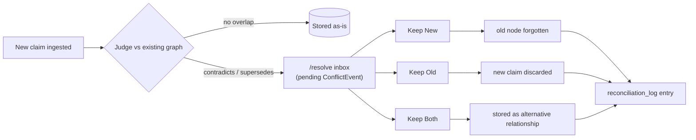
```mermaid
flowchart LR
    New["New claim ingested"] --> J{"Judge vs existing graph"}
    J -->|no overlap| Store[(Stored as-is)]
    J -->|contradicts / supersedes| Inbox["/resolve inbox\n(pending ConflictEvent)"]
    Inbox --> KN["Keep New"] --> PruneOld["old node forgotten"]
    Inbox --> KO["Keep Old"] --> DropNew["new claim discarded"]
    Inbox --> KB["Keep Both"] --> Alt["stored as alternative relationship"]
    PruneOld --> Log["reconciliation_log entry"]
    DropNew --> Log
    Alt --> Log
```

### 10.2 The Decay Engine
Confidence scores of unreinforced graph nodes degrade over time (by 0.15 per sweep invocation). If a node's confidence score drops below 0.20, Engram invokes `cognee.forget()` to prune the node from the active graph store.

The sweep runs **autonomously on a schedule**, not just on demand. A daily GitHub Actions cron ([`.github/workflows/maintenance.yml`](https://github.com/Aditya060806/Engram/blob/main/.github/workflows/maintenance.yml)) calls `POST /maintenance/decay-all`, which fans out across every user that owns reconcilable memory and runs the decay tick for each — so stale beliefs lose confidence and eventually forget themselves with no human in the loop. It can also be triggered manually (`POST /decay/run` for the current user, or the workflow's "Run workflow" button). The job needs a repository secret `ENGRAM_ACCESS_KEY` matching the backend's access key; if the secret is absent the run skips cleanly instead of failing.

### 10.3 Temporal Query Diffs
Queries matching historical comparison patterns (e.g. "what changed since March?") extract diff matrices outlining added nodes, deleted nodes, changed schemas, and newly recorded decisions.

### 10.4 Bring-Your-Own-Key (BYOK) & Live Discovery
Self-hosting users can connect their own accounts/keys for Groq, OpenAI, or Gemini. The application features a secure, guided 3-step setup: provider selection, API key validation, and live model list discovery. Keys are encrypted at rest using a symmetric cipher (`Fernet`) and never exposed in console logging or frontend payloads.

### 10.5 The Recap — "Where's My Context?"
A direct answer to the hackathon's premise. The `/recap` view is a *morning-after digest* of your memory: **"Here's what happened while you were out."** For a chosen window (7/30/90 days) it stitches together every Cognee lifecycle operation into one narrative — sources **remembered**, decisions and reinforcements from **improve/cognify**, contradictions **reconciled**, and stale nodes **forgotten** — then uses `recall()` plus the LLM to write a punchy, grounded summary. Animated count-up stats and a reveal-on-scroll event timeline make the invisible work of a self-maintaining memory legible at a glance.

### 10.6 Agent Memory over MCP (read + write)
Engram is not just a dashboard, it is a memory **backend any agent can use across runs**. The MCP server ([`mcp_server.py`](https://github.com/Aditya060806/Engram/blob/main/backend/mcp_server.py)) exposes the full lifecycle as six tools, scoped to a stable agent identity (`ENGRAM_MCP_USER_ID`) so memory persists between sessions:

| MCP tool | Type | Wraps | Purpose |
|---|---|---|---|
| `engram_remember` | write | `ingest_source(text)` | Store a fact/decision; structured into the graph and reconciled |
| `engram_recall` | read | `answer_query` | Graph-grounded answer with diff + timeline |
| `engram_improve` | write | `run_memory_improve` | Enrich the graph (improve/memify) |
| `engram_forget` | write | `forget_source` / `forget_node` | Prune a source or node |
| `engram_review` | read | `get_review_candidates` | Lowest-confidence facts to revisit |
| `engram_graph_snapshot` | read | `get_graph_snapshot` | Full nodes + edges |

`engram_remember` polls the ingest job to completion, so an agent gets a definitive result before continuing. This is what turns "never-forget workflows" from a claim into a working integration: an agent loop can learn into Engram today and act smarter tomorrow.

**Register Engram in an MCP client.** The server speaks MCP over stdio, so any MCP-capable client (Claude Desktop, Cursor, Kiro, custom agents) can mount it. Add this to your client's MCP config (for example `mcp.json`), pointing at the backend virtual-env Python so dependencies resolve:

```json
{
  "mcpServers": {
    "engram": {
      "command": "python",
      "args": ["mcp_server.py"],
      "cwd": "/absolute/path/to/Engram/backend",
      "env": {
        "ENGRAM_MCP_USER_ID": "mcp_agent"
      },
      "disabled": false,
      "autoApprove": ["engram_recall", "engram_review", "engram_graph_snapshot"]
    }
  }
}
```

- Use the venv interpreter if your client does not activate it, for example `command: "/absolute/path/to/Engram/backend/venv/bin/python"` (macOS/Linux) or `backend\\venv\\Scripts\\python.exe` (Windows).
- The server loads LLM and Cognee credentials from `backend/.env`, the same as the API. With `COGNEE_API_KEY` + `COGNEE_SERVICE_URL` set, the agent's memory lands on your Cognee Cloud tenant; without them it uses the self-hosted SDK.
- `ENGRAM_MCP_USER_ID` scopes the agent's memory so it persists across sessions. Give different agents different ids to isolate their memories.
- Read-only tools are safe to auto-approve; the write tools (`engram_remember`, `engram_improve`, `engram_forget`) are left for explicit approval.

**Example agent loop across two runs:**

```text
# Monday
engram_remember(text="Customer Acme is on the Enterprise plan; renewal is in March.")
  -> Remembered 'Customer Acme is on...'. Structured into the graph and reconciled.

# Friday, a fresh session with no chat history
engram_recall(query="What plan is Acme on and when do they renew?")
  -> Answer: Acme is on the Enterprise plan, renewing in March. (source: cognee / graph-completion)
```

No context window, no re-priming: the fact was written into the graph on Monday and recalled from it on Friday.

### 10.7 Hackathon use cases this maps to
The same lifecycle covers several of the suggested example categories:

| Example | How Engram fulfills it |
|---|---|
| **Research & Knowledge Copilots** | Ingest papers, repos, articles, and video into a living graph; recall via deep graph traversal, with 3D graph, schema inventory, and provenance. This is Engram's core. |
| **Personal Memory Agents** | Cross-session session memory, decisions as first-class nodes, and reconciliation so changed preferences update instead of duplicating. |
| **Self-Improving Agents** | `improve()`/`memify` plus session feedback (score + text) and confidence decay that reweights unused knowledge. |
| **Never-Forget Workflows** | Read + write MCP tools let any agent/pipeline carry context between runs (see 10.6). |
| **Support & Customer Memory** | Per-user isolated memory (`X-User-Id`): ingest a customer's past tickets as notes/conversations, then recall their full history. |
| **Learning & Tutoring Tools** | The per-user graph is a personalized knowledge map; confidence doubles as a mastery signal, surfaced by `/review` and `engram_review`. |

### 10.8 Resilient ingestion & grounded recall

Two things quietly break most "paste a link" memory tools; Engram handles both.

**Extracting JS-rendered chat shares.** Modern ChatGPT and Claude share pages no longer embed the conversation in server-rendered HTML (`__NEXT_DATA__` is gone) — the messages are streamed client-side as escaped React-Flight script data. A plain HTTP fetch therefore sees only a "log in to view" stub. Engram's `/import/chat-url` recovers the real conversation directly from that embedded script payload (`_harvest_conversation_from_html` → `harvest_natural_strings`): it isolates the conversation-bearing `<script>` block, pulls the readable natural-language strings out of the flight encoding, decodes unicode/newline escapes, and drops class-name/id/markup noise. Login-wall boilerplate is explicitly rejected (`looks_like_login_wall`) so a stub is never ingested as if it were the chat. Verified live against a real ChatGPT share link (recovered ~99k chars of the actual conversation, English and Hindi). This is inherently best-effort scraping of a JS app with no public API, so extraction may need updates if the providers change their payload format again.

**Answering from what was ingested.** Recall is graph-first via Cognee, but two gaps used to swallow a valid answer. (1) A source's stored body is now matched against the question directly (`source_matches_terms`), not just its label — so a conversation imported as "ChatGPT Chat" is found when your question words only appear *inside* it, with bounded, term-centered snippets (`snippets_around_terms`) so a large chat never blows the prompt. (2) When Cognee's graph-completion returns a "don't have that info" style answer — common in the seconds after ingest while `cognify` is still building the graph — it is recognized as a refusal (`looks_like_refusal`) and recall falls through to the grounded answer instead of surfacing the refusal. These paths are covered by unit tests in [`backend/tests/test_units.py`](https://github.com/Aditya060806/Engram/blob/main/backend/tests/test_units.py).

---

## 11. The Math: Confidence, Decay, and Reconciliation

### Confidence decay curve

Every unreinforced node loses **0.15** confidence per decay sweep. Once it drops **below 0.20**, `forget()` prunes it. Starting from a freshly ingested fact at confidence `1.0`, this is the trajectory:

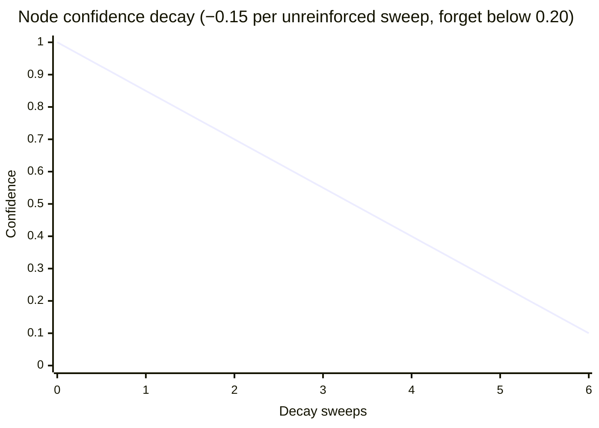
```mermaid
xychart-beta
    title "Node confidence decay (−0.15 per unreinforced sweep, forget below 0.20)"
    x-axis "Decay sweeps" [0, 1, 2, 3, 4, 5, 6]
    y-axis "Confidence" 0 --> 1
    line [1.0, 0.85, 0.70, 0.55, 0.40, 0.25, 0.10]
```

| Sweep | Confidence | State |
|---|---|---|
| 0 | 1.00 | Active (freshly ingested) |
| 1 | 0.85 | Active |
| 2 | 0.70 | Active |
| 3 | 0.55 | Decaying |
| 4 | 0.40 | Decaying |
| 5 | 0.25 | Decaying (near threshold) |
| 6 | 0.10 | **Forgotten** (< 0.20 → `forget()`) |

Any reinforcement (re-ingesting or confirming a fact) resets the node toward `1.0`, so actively used knowledge never decays out.

### Decay windows

Decay behavior is tunable in Settings and stored in `decay_settings`:

- **`decay_start_days`** (default **60**): grace period before an untouched node begins losing confidence.
- **`forget_threshold_days`** (default **180**): the age past which a persistently unreinforced node is eligible for pruning.

### Reconciliation decision matrix

| User choice | Old node | New node | Graph result | Logged as |
|---|---|---|---|---|
| **Keep New** | forgotten | promoted | old superseded, new active | `changed` / `new_decision` |
| **Keep Old** | retained | discarded | no change to active truth | `removed` (of new claim) |
| **Keep Both** | retained | added | both kept as alternatives | `added` |

---

## 12. API Reference

All backend routes require the shared `X-Engram-Key` header (injected by the Vercel proxy) and carry `X-User-Id` for per-user routing. Selected routes are rate-limited via SlowAPI.

| Method | Endpoint | Purpose | Rate limit |
|---|---|---|---|
| `GET` | `/` | Service metadata + live Cognee routing status | — |
| `GET` | `/health` | Liveness probe | — |
| `GET` | `/metrics` | Per-endpoint response-time stats (avg / p50 / p95) | — |
| `POST` | `/ingest` | Ingest a source (pdf, github, article, youtube, conversation, text) | 10/min |
| `GET` | `/ingest/{job_id}` | Poll an ingestion job | — |
| `POST` | `/import/chat-url` | Import a public ChatGPT/Claude/Gemini share link | — |
| `GET` | `/graph-snapshot` | Full nodes + edges snapshot for the 3D graph | — |
| `POST` | `/nodes/summarize` | Summarize a node on demand | — |
| `GET` | `/nodes/search` | Search nodes by query | — |
| `POST` | `/recall` | Graph-grounded, time-aware query | 20/min |
| `GET` | `/topics` | Suggested "Ask" topics | — |
| `GET` | `/ask-questions` | Generated starter questions | — |
| `GET` | `/reconciliation/events` | Pending + resolved conflicts | — |
| `POST` | `/reconciliation/resolve` | Resolve a conflict (keep old/new/both) | — |
| `POST` | `/decay/run` | Trigger a decay sweep (current user) | — |
| `POST` | `/maintenance/decay-all` | Autonomous decay sweep across all users (scheduled cron) | 4/min |
| `GET` | `/decay/settings` | Read decay windows | — |
| `POST` | `/memory/improve` | Run enrichment (memify/cognify) | 6/min |
| `GET` | `/sources` | List ingested sources | — |
| `POST` | `/forget/node` | Prune a single node | — |
| `POST` | `/forget/source` | Prune an entire source | — |
| `POST` | `/reset-demo` | Reset demo data | — |
| `GET` | `/cognee/activity` | Live Cognee operation log | — |
| `GET` | `/cognee/graph-status` | Graph build state (building / ready / node count) | — |
| `GET` | `/review` | Facts most in need of review (lowest confidence first) | — |
| `GET` | `/provenance` | Cognee provenance HTML (rendered in an iframe) | — |
| `GET` | `/schema-inventory` | Entity-type inventory with samples | — |
| `GET` | `/recap` | "Where's My Context?" digest (window in days) | 20/min |
| `POST` | `/session/history` | Session Q&A history | — |
| `POST` | `/session/distill` | Distill session guidance | — |
| `POST` | `/session/remember` | Store a chat turn in session memory | — |
| `POST` | `/session/feedback` | Attach feedback to a Q&A entry | — |
| `POST` | `/ai/models` | Live model discovery for a provider | 10/min |
| `GET` | `/ai/config` | Read current BYOK config (no secrets) | — |
| `POST` | `/ai/config` | Save BYOK config (key encrypted at rest) | 5/min |
| `GET` | `/chat/conversations` | List the user's saved conversations | — |
| `GET` | `/chat/conversations/{id}` | Fetch a conversation's messages | — |
| `POST` | `/chat/conversations` | Save/update a conversation (server-side history) | — |
| `DELETE` | `/chat/conversations/{id}` | Delete a conversation | — |

Interactive OpenAPI docs are available at `/docs` on the running backend.

---

## 13. Comparison With Other Memory Approaches

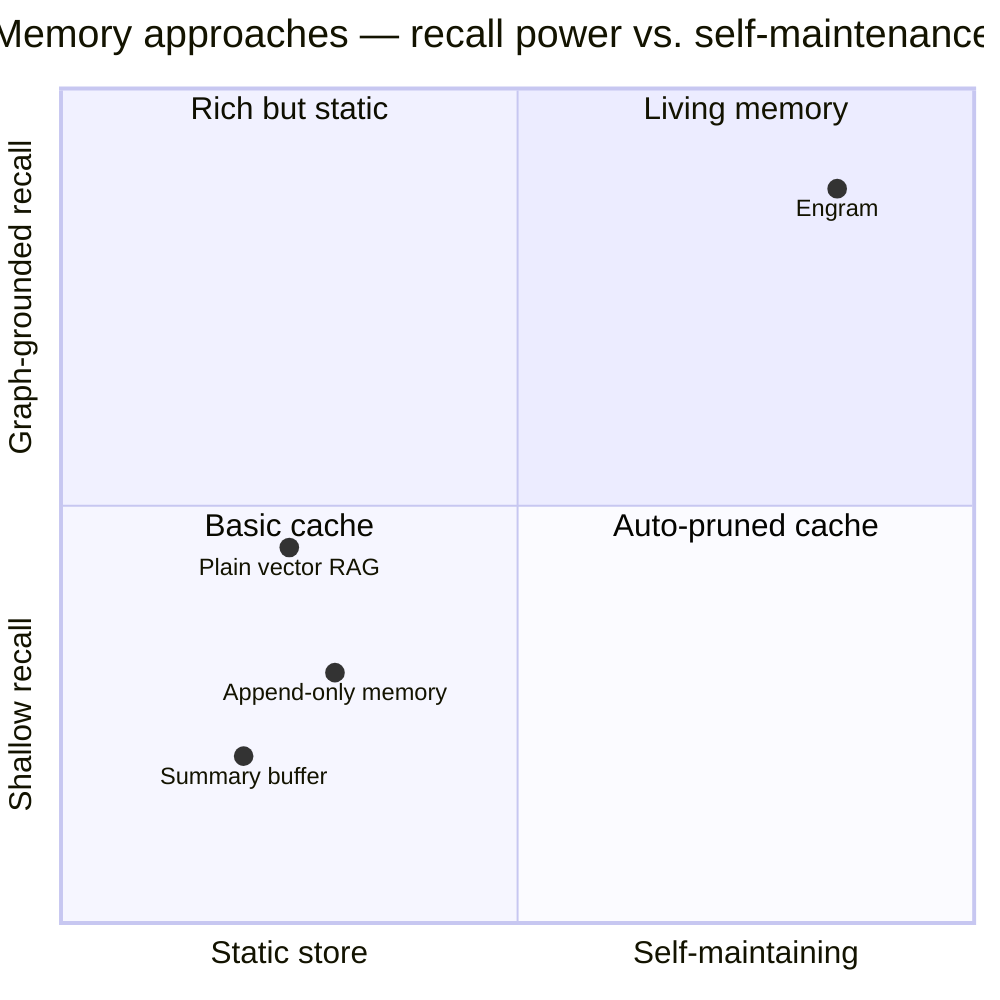
```mermaid
quadrantChart
    title Memory approaches — recall power vs. self-maintenance
    x-axis "Static store" --> "Self-maintaining"
    y-axis "Shallow recall" --> "Graph-grounded recall"
    quadrant-1 "Living memory"
    quadrant-2 "Rich but static"
    quadrant-3 "Basic cache"
    quadrant-4 "Auto-pruned cache"
    "Plain vector RAG": [0.25, 0.45]
    "Append-only memory": [0.30, 0.30]
    "Summary buffer": [0.20, 0.20]
    "Engram": [0.85, 0.88]
```

| Dimension | Plain vector RAG | Append-only memory | **Engram** |
|---|---|---|---|
| Storage model | Embeddings only | Log of entries | Hybrid graph + vector (Cognee) + metadata |
| Truth over time | None | Everything is "true" | Reconciled, superseded, or forgotten |
| Contradiction handling | Silent duplicates | Silent duplicates | Detected, queued, human-resolved |
| Forgetting | Manual | Manual | Automatic confidence decay |
| Explainability | Low | Low | Provenance + schema inventory + audit log |
| Time-travel queries | No | No | "What changed since X?" diff cards |

### Scorecard (1 point per capability from §2)

| Approach | Ingest | Recall | Detect conflicts | Reconcile | Confidence | Decay/forget | Temporal diffs | Provenance | Typed graph | Full Cognee | **Total** |
|---|:---:|:---:|:---:|:---:|:---:|:---:|:---:|:---:|:---:|:---:|:---:|
| Summary buffer | ½ | ½ | ✗ | ✗ | ✗ | ✗ | ✗ | ✗ | ✗ | ✗ | **1** |
| Append-only memory | 1 | 1 | ✗ | ✗ | ✗ | ✗ | ✗ | ✗ | ✗ | ✗ | **3** |
| Vector-store RAG | 1 | 1 | ✗ | ✗ | ✗ | ✗ | ✗ | ½ | ✗ | ✗ | **4** |
| **Engram** | ✅ | ✅ | ✅ | ✅ | ✅ | ✅ | ✅ | ✅ | ✅ | ✅ | **10** |

The gap is not incremental. Engram is the only row that treats memory as a lifecycle with an opinion about truth over time, which is exactly the "Where is My Context?" problem this hackathon poses.

---

## 14. Technical Stack

**Frontend**
- **Next.js 16** (App Router) + **React 19** + **TypeScript 5**
- **Tailwind CSS v4** with `tw-animate-css`, shadcn, and Base UI primitives
- **`react-force-graph-3d` / `react-force-graph-2d`** + **three.js** for the node network
- **GSAP** + **Lenis** for animations and smooth scrolling
- **NextAuth v5** (GitHub / Google OAuth), **lucide-react** icons

**Backend**
- **FastAPI** (Python) with **SlowAPI** rate limiting and **Pydantic v2** contracts
- SQLite/PostgreSQL metadata database ([database.py](https://github.com/Aditya060806/Engram/blob/main/backend/database.py)) with a unified connection wrapper for both engines
- The **Cognee SDK 1.2.2**, plus a direct REST client to a hosted **Cognee Cloud** tenant ([cognee_cloud.py](https://github.com/Aditya060806/Engram/blob/main/backend/cognee_cloud.py))
- **LiteLLM**-backed Gemini / Groq / OpenAI wrappers for fallback reasoning
- Ingestion: **PyGithub** (repos), **pypdf** (PDFs), **trafilatura** (articles), **youtube-transcript-api** (video transcripts)
- Security: **cryptography** (`Fernet`) for BYOK key encryption at rest

**Infrastructure**
- Frontend on **Vercel** (zero-config), backend on **Render** (`render.yaml` blueprint), production data on **PostgreSQL + PGVector**.

### 14.1 Performance & Latency

Engram is engineered so the parts under our control add as little latency as possible. The inherent model and graph-completion time is what it is, but the avoidable overhead around it is removed.

| Layer | Optimization | Why it matters |
|---|---|---|
| Cognee Cloud calls | **Pooled keep-alive HTTP client** ([cognee_cloud.py](https://github.com/Aditya060806/Engram/blob/main/backend/cognee_cloud.py)) | Reuses warm connections across every recall / ingest / cognify / graph call, skipping a fresh TCP + TLS handshake (~100 to 300 ms) that the previous per-request client paid every time |
| Backend reads | **In-memory TTL + LRU cache** ([cache.py](https://github.com/Aditya060806/Engram/blob/main/backend/cache.py)) | Graph snapshot, schema inventory, topics, and recap are cached (30 to 300 s), so repeat views are served without recomputation |
| Frontend fetches | **Client cache + request dedupe** ([api-cache.ts](https://github.com/Aditya060806/Engram/blob/main/frontend/src/lib/api-cache.ts)) | Identical in-flight requests share one promise; cached GETs skip the network; writes invalidate only the affected keys |
| Navigation | **Cache prewarming on app entry** ([Prewarm.tsx](https://github.com/Aditya060806/Engram/blob/main/frontend/src/components/Prewarm.tsx)) | Common data (sources, topics, conflicts) is warmed 300 ms after paint, so opening those pages renders from cache instantly |
| Proxy | **Extended `maxDuration` + fast-fail connect timeout** | Slow-but-valid backend responses are not cut into 502s; unreachable tenants fail fast to the local fallback instead of hanging |
| UI feel | **GSAP + Lenis transitions, route progress bar, on-load hero entrance** | Motion is smooth and continuous rather than janky, and route changes show immediate progress feedback |

**Design principles behind the speed:**

- **Cognee-first, fallback-fast.** Recall hits the graph first; if the tenant is unreachable, a capped connect timeout falls back to local memory rather than blocking the request.
- **Never double-fetch.** Prewarming, client cache, and in-flight dedupe are layered so a page mounting mid-request joins the existing call instead of firing a new one.
- **Async, non-blocking ingestion.** Ingest returns a job id immediately and builds the graph in the background; the [graph-status indicator](#106-agent-memory-over-mcp-read--write) shows progress instead of blocking the UI.
- **Targeted invalidation.** A write only clears the cache keys it actually affects (see the invalidation map in `api-cache.ts`), so unrelated views stay warm.

> These changes remove avoidable overhead (repeated handshakes, redundant round trips, layout jank). They do not, and cannot, remove the real server-side time Cognee spends on graph completion and `cognify`, which is inherent to building and querying a knowledge graph.

### Measured latency (live tenant)

Every response carries an `X-Response-Time-Ms` header, and `GET /metrics` returns rolling per-endpoint stats. Measured on the live Render + Cognee Cloud deploy (2026-07-03), the numbers split cleanly by workload:

| Path | Typical latency | What dominates |
|---|---|---|
| Cached reads / light endpoints (`/metrics`, `/health`, warm `/sources`, `/graph-status`) | **sub-millisecond to low-ms** (for example `/metrics` at ~0.7 ms) | served from memory, no external call |
| Graph-grounded recall, warm (`/recall`, median) | **~8 s** (p50 backend ~8.0 s) | Cognee `GRAPH_COMPLETION`: graph traversal + LLM answer synthesis |
| First recall after idle (cold start) | **up to ~40 s** (the p95/max outlier) | Render free-tier spin-up + first cold graph-completion |

**Honest reading of these numbers:**

- The **~8 s recall time is inherent**, not overhead. A grounded answer runs a graph traversal plus an LLM completion over the retrieved context. That is the cost of a correct, sourced answer instead of a blind guess, and no amount of connection pooling changes it.
- End-to-end (client) and backend times differ by only ~300 ms, which confirms the **network/transport overhead is already small** and the pooling work paid off; the time is spent in Cognee, not in handshakes or transport.
- The **cold-start outlier** is a Render free-tier characteristic (the service sleeps when idle). A paid instance or a keep-warm ping removes it; it is not an application cost.
- Where latency is actually under our control, **navigation and cached reads, it is effectively instant** (single-digit milliseconds).

> Reproduce: `python backend/benchmark_recall.py --url <backend-url> --no-ingest` prints avg/p50/p95 for both client and backend timing and writes the table to `backend/benchmark_results.md`.

---

## 15. Project Structure

```text
Engram/
├── backend/
│   ├── main.py                # FastAPI app + all routes
│   ├── services/__init__.py   # memory lifecycle logic (remember/recall/improve/forget)
│   ├── cognee_cloud.py        # hosted Cognee Cloud REST client
│   ├── database.py            # SQLite/PostgreSQL wrapper + schema init
│   ├── models/__init__.py     # Pydantic request/response contracts
│   ├── cache.py               # in-memory TTL cache
│   ├── context.py             # per-request user context
│   ├── mcp_server.py          # MCP server exposing Engram memory tools
│   ├── test_cognee_cloud.py   # live end-to-end lifecycle test
│   ├── requirements.txt
│   └── render.yaml is at repo root
├── frontend/
│   ├── src/app/               # App Router pages (ask, graph, resolve, ingest, recap, ...)
│   │   └── api/proxy/[...path] # authenticated backend proxy
│   ├── src/lib/               # auth + client helpers
│   ├── public/images/         # screenshots + provider icons
│   └── package.json
├── render.yaml                # Render deployment blueprint (backend)
├── README.md
├── CONTRIBUTING.md
├── CODE_OF_CONDUCT.md
└── LICENSE
```

---

## 16. Local Setup

### Backend Setup

> **Python 3.11+** is required. (The `numpy` pin is set for 3.11 compatibility.)

1. Navigate to the backend directory:
   ```bash
   cd backend
   ```
2. Create and activate a virtual environment:
   ```bash
   python -m venv venv
   source venv/bin/activate      # Windows: .\venv\Scripts\Activate.ps1
   ```
3. Install dependencies:
   ```bash
   pip install -r requirements.txt
   ```
4. Set the environment variables in a `.env` file:
   ```env
   # LLM for Engram's own reasoning (Ask answers, reconciliation, Recap narrative)
   LLM_PROVIDER=groq
   GROQ_API_KEY=your_groq_key
   LLM_MODEL_FALLBACK=groq/llama-3.3-70b-versatile
   # (or) LLM_PROVIDER=gemini + GEMINI_API_KEY=your_AIza_key

   ENVIRONMENT=development
   FRONTEND_URL=http://localhost:3000
   ENGRAM_ACCESS_KEY=change-me
   ENGRAM_ENCRYPTION_KEY=random-32+ -chars   # encrypts BYOK keys at rest

   # Optional: route remember/recall/improve/forget to a hosted Cognee Cloud tenant.
   # Activates only when BOTH are set. Find them in your Cognee Cloud dashboard.
   COGNEE_API_KEY=your_cognee_cloud_api_key
   COGNEE_SERVICE_URL=https://<your-tenant>.aws.cognee.ai
   COGNEE_TENANT_ID=<your-tenant-uuid>
   ```
5. Start the backend server:
   ```bash
   python -m uvicorn main:app --reload --port 8000
   ```
   Look for `[Cognee] Connected to Cognee Cloud tenant …` to confirm cloud routing is live.
6. (Optional) Verify all four Cognee operations against your tenant:
   ```bash
   python test_cognee_cloud.py
   ```

> **DNS note:** if you hit `getaddrinfo failed` / "DNS operation refused" reaching the tenant, your resolver is flaky — run `ipconfig /flushdns` (Windows) or set your DNS to `8.8.8.8` / `1.1.1.1`.

### Frontend Setup
1. Navigate to the frontend directory:
   ```bash
   cd ../frontend
   ```
2. Install dependencies:
   ```bash
   npm install
   ```
3. Start the local development server:
   ```bash
   npm run dev
   ```
4. Open [http://localhost:3000](http://localhost:3000) in your browser.

---

## 17. Deployment

Engram ships as two independent deploys that talk over an authenticated proxy.

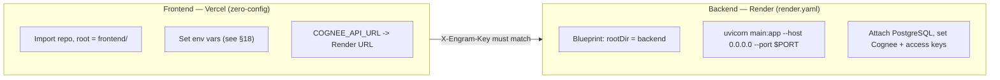
```mermaid
flowchart LR
    subgraph FE["Frontend — Vercel (zero-config)"]
        direction TB
        f1["Import repo, root = frontend/"]
        f2["Set env vars (see §18)"]
        f3["COGNEE_API_URL -> Render URL"]
    end
    subgraph BE["Backend — Render (render.yaml)"]
        direction TB
        b1["Blueprint: rootDir = backend"]
        b2["uvicorn main:app --host 0.0.0.0 --port $PORT"]
        b3["Attach PostgreSQL, set Cognee + access keys"]
    end
    FE -->|X-Engram-Key must match| BE
```

**Backend (Render):**
1. Deploy from the `render.yaml` blueprint at the repo root (`rootDir: backend`).
2. Start command: `uvicorn main:app --host 0.0.0.0 --port $PORT`.
3. Provision PostgreSQL and set `DATABASE_URL`, plus `ENGRAM_ACCESS_KEY`, `ENGRAM_ENCRYPTION_KEY`, and the Cognee Cloud vars.
4. Confirm `GET /health` returns `{"status":"ok","service":"engram-cognee"}`.

**Frontend (Vercel):**
1. Import the repo with the project root set to `frontend/` (zero-config Next.js).
2. Set the environment variables from §18. Point `COGNEE_API_URL` at the Render backend URL.
3. Ensure `ENGRAM_ACCESS_KEY` matches the backend exactly, and register the Vercel domain as an OAuth callback for GitHub and Google.

> The frontend never calls the backend directly from the browser. Requests go through `/api/proxy/[...path]`, which injects the shared key and the signed-in user id server-side.

---

## 18. Environment Variables Reference

### Backend (Render / local `.env`)

| Variable | Required | Purpose |
|---|:---:|---|
| `ENGRAM_ACCESS_KEY` | ✅ | Shared secret the proxy sends as `X-Engram-Key`. Must match the frontend. |
| `ENGRAM_ENCRYPTION_KEY` | ✅ | 32+ char secret used to encrypt BYOK keys at rest (`Fernet`). |
| `LLM_PROVIDER` | ✅ | `groq` / `gemini` / `openai` — provider for fallback reasoning. |
| `GROQ_API_KEY` / `GEMINI_API_KEY` / `OPENAI_API_KEY` | one of | Key for the chosen fallback provider. |
| `LLM_MODEL_FALLBACK` | optional | Default model id for fallback answers. |
| `DATABASE_URL` | prod | PostgreSQL connection string (SQLite used if unset locally). |
| `COGNEE_API_KEY` | optional | Enables hosted Cognee Cloud routing (with the two below). |
| `COGNEE_SERVICE_URL` | optional | Cognee Cloud tenant base URL. |
| `COGNEE_TENANT_ID` | optional | Cognee Cloud tenant UUID. |
| `FRONTEND_URL` | ✅ | Allowed CORS origin. |
| `GITHUB_TOKEN` | optional | Raises GitHub API limit 60→5000/hr and enables private-repo ingestion. Public repos work without it. |
| `ENVIRONMENT` | optional | `development` / `production` (keep `production` on deployed hosts). |

### Frontend (Vercel / local `.env.local`)

| Variable | Required | Purpose |
|---|:---:|---|
| `AUTH_SECRET` | ✅ | NextAuth v5 signing secret. |
| `AUTH_GITHUB_ID` / `AUTH_GITHUB_SECRET` | ✅ | GitHub OAuth app credentials. |
| `AUTH_GOOGLE_ID` / `AUTH_GOOGLE_SECRET` | ✅ | Google OAuth client credentials. |
| `COGNEE_API_URL` | ✅ (prod) | Backend base URL the proxy forwards to (Render URL in prod). |
| `ENGRAM_ACCESS_KEY` | ✅ | Must match the backend's `ENGRAM_ACCESS_KEY`. |
| `NEXT_PUBLIC_APP_URL` | ✅ | Public site URL for metadata / OG / canonical. |
| `ALLOW_GUEST_LOGIN` / `NEXT_PUBLIC_ALLOW_GUEST_LOGIN` | local only | Enables the guest preview button. Leave unset in production. |

---

## 19. Security Model

- **Authenticated proxy boundary.** The browser never holds the backend key. `/api/proxy/[...path]` runs server-side on Vercel, injecting `X-Engram-Key` and the session `X-User-Id`.
- **Per-user data isolation.** Every metadata table carries a `user_id`; queries are scoped to the signed-in user.
- **BYOK secrets encrypted at rest.** Provider API keys are encrypted with `Fernet` (`ENGRAM_ENCRYPTION_KEY`) and never logged or returned to the client.
- **Rate limiting.** Sensitive routes (ingest, recall, enrichment, model discovery, config) are throttled with SlowAPI.
- **Request size caps.** The proxy rejects bodies over 12 MB; ingest content is length-bounded by the Pydantic contract.
- **OAuth-gated app.** All app routes except the landing and login pages require GitHub/Google sign-in.

---

## 20. Known Limitations

- **Authentication Model**: Authentication via GitHub/Google OAuth is enforced for all routes except the landing page and login page. The session user ID is threaded to the backend via the `X-User-Id` header for per-user data routing. The backend trusts that header behind a shared access key (compared in constant time). This is sufficient for the current deployment; a hardened multi-tenant setup would verify a per-user signed token (e.g. a NextAuth JWT) rather than trust the header. Tracked as post-hackathon work.
- **Two stores, eventual consistency**: Lifecycle state (sources, conflicts, confidence, decay) lives in SQL as the system of record, while the semantic graph lives in Cognee. They are linked by a stored `cognee_data_id` per source (deterministic prune), but they are not transactionally coupled, so a failed cloud call can leave them briefly out of sync. Source-level prune is exact; claim-level prune is best-effort (see below).
- **DB calls in async handlers**: Most metadata reads/writes run synchronously inside async request handlers (only the heaviest paths are offloaded to threads). This is fine for the current usage; under high concurrent load on Postgres it would benefit from moving the DB layer fully off the event loop.
- **Chat History Persistence**: Conversations are now persisted **server-side** per user (`chat_conversations` table) and mirrored to `localStorage` as an offline cache, so history survives across devices and browser clears. Each answered turn is also written back into Cognee memory so it is recallable in future sessions.
- **Database Scope**: The database configuration supports both a local SQLite file (default for local development) and a managed PostgreSQL instance with PGVector for remote Vercel/production deployment.
- **Cognee Per-Request LLM Isolation (Upstream Issue #2228)**: LLM configuration for Cognee's own internal pipeline (`remember`/`recall`/`improve`/`forget`) is applied per-request but relies on Cognee's global process-wide config state. This is fully safe under this project's single-session usage pattern, but would require request-scoped isolation (or waiting on Cognee's roadmap for issue #2228) before being run under highly concurrent multi-tenant loads.
- **AI Chat Import Depends on External Page Structure**: The chat-URL importer (`/import/chat-url`) scrapes undocumented page structure from ChatGPT, Claude, and Gemini public share links. These platforms may change their page layout at any time with no notice, which can break import for a specific platform. This is not a Engram bug — the feature works within the limits of what each platform's public share page exposes.
- **Article ingestion vs. bot protection**: Article ingestion uses `trafilatura` to fetch page text. Sites with aggressive bot protection (e.g. large corporate/news domains) will refuse or time out the request. GitHub repos, PDFs, and scraper-friendly pages (blogs, Wikipedia) are the reliable paths.
- **Decay-sweep pruning on Cloud is best-effort**: The decay sweep now routes `forget()` through the Cloud client, resolving each decayed claim to a tenant data item by name match and pruning it by `dataId` (with local SDK fallback). Because decay operates at the claim level while Cognee forgets whole data items, a claim that does not map cleanly to a single data item is logged and skipped rather than over-pruning. It no longer silently touches only the local store.

---

## 21. Roadmap

**Recently shipped**

- [x] Hosted Cognee Cloud routing live in production, verified by `/` status (`recall_source: cognee-cloud`).
- [x] Measured 100% Cognee-served recall over a 10-query live-tenant benchmark.
- [x] Schema-guided typed extraction (`graph_model` + custom prompt) so the graph is `Fact`/`Decision`/`Topic` nodes with `supersedes`/`contradicts` edges.
- [x] **Conversations are remembered into Cognee** — each answered turn is written back so future sessions can recall it.
- [x] **Server-side chat history** (`chat_conversations`) with cross-device sync and `localStorage` fallback.
- [x] Decay `forget()` routes to the Cognee Cloud tenant (best-effort `dataId`) instead of local-only.
- [x] Cloud session guidance derived from the reconciliation log (the "Engram has noticed" panel now works in production).
- [x] **Graph-derived reconciliation** — `reconcile_from_graph()` reads `supersedes`/`contradicts` edges from the Cognee graph and creates conflict events, so Cognee is the detector (verified live: it turned a Supabase-supersedes-Postgres edge into a conflict).
- [x] **Deterministic prune** — sources store their Cognee `dataId` at ingest, so `forget()` prunes by exact id, not fuzzy name match.
- [x] Per-user isolation hardening: per-user activity feed, rate-limit keyed by user, per-user session id on the chat path, constant-time access-key compare.
- [x] Fixed the chat feedback loop so `qa_id` persists and 👍/👎 attaches on the cloud path.
- [x] Backend unit tests wired into CI (ruff + eslint + build + pytest).
- [x] Robust GitHub ingestion: resolves the repo's real default branch (not just main/master), strips NUL bytes that Postgres rejects, and supports private repos + higher rate limits via `GITHUB_TOKEN`.
- [x] `GET /cognee/graph-status` endpoint + live "graph is building" indicator on ingest.
- [x] `GET /metrics` per-endpoint response-time stats + `X-Response-Time-Ms` headers.
- [x] Root diagnostic (`cognee_status()`) that surfaces cloud config state and any missing env vars.
- [x] Read + write MCP tools so agents can remember/recall/improve/forget across runs.
- [x] Keep-warm workflow to avoid free-tier cold starts.
- [x] Free-text note ingestion (the sixth source type).

**Next up**

- [ ] Request-scoped Cognee LLM config for safe multi-tenant concurrency (tracking upstream #2228).
- [ ] Scheduled background decay sweeps (cron) instead of on-demand.
- [ ] Additional ingestion connectors (Notion, Slack, Google Docs).
- [ ] Shareable, read-only graph snapshots.
- [ ] Optional answer streaming via an LLM grounded on Cognee retrieval (behind a toggle, since it trades away the `provider=cognee` guarantee).

---

## 22. FAQ

**Is Cognee actually the primary path, or just a wrapper over an LLM?**
Cognee is the primary recall path. Answers are served from the graph via `GRAPH_COMPLETION` and only fall back to an LLM when the graph has no grounded answer (for example on a brand-new, empty deploy). The full `remember`/`recall`/`improve`/`forget` lifecycle is load-bearing.

**Do I need a Cognee Cloud tenant to run it?**
No. Without `COGNEE_API_KEY` + `COGNEE_SERVICE_URL` + `COGNEE_TENANT_ID`, Engram uses the embedded local Cognee SDK. Set all three to route to a hosted tenant.

**Where are my API keys stored?**
BYOK keys are encrypted at rest with `Fernet` and never returned to the browser or written to logs.

**Why did an answer say `provider=groq` instead of `provider=cognee`?**
The graph had no grounded answer at query time (commonly an empty graph right after deploy). Ingest content first; once the graph has nodes, recall is served by Cognee.

**Can other agents use this memory?**
Yes, both to read and to write. [`backend/mcp_server.py`](https://github.com/Aditya060806/Engram/blob/main/backend/mcp_server.py) exposes six MCP tools (`remember`, `recall`, `improve`, `forget`, `review`, `graph_snapshot`) over stdio. Any MCP client can register it (see [10.6 Agent Memory over MCP](#106-agent-memory-over-mcp-read--write) for the `mcp.json` snippet), and an agent's memory persists across runs via `ENGRAM_MCP_USER_ID`.

---

## Contributing

Contributions are welcome! See [CONTRIBUTING.md](CONTRIBUTING.md) for setup instructions, code conventions, and the pull request process. This project also uses a [Code of Conduct](CODE_OF_CONDUCT.md) and has a [security policy](SECURITY.md).

Look for issues tagged [`good first issue`](https://github.com/Aditya060806/Engram/issues?q=is%3Aissue+is%3Aopen+label%3A%22good+first+issue%22) for well-scoped starting points.

---

## Author

Built by [Aditya Pandey](https://github.com/Aditya060806) for the WeMakeDevs × Cognee Hackathon.
