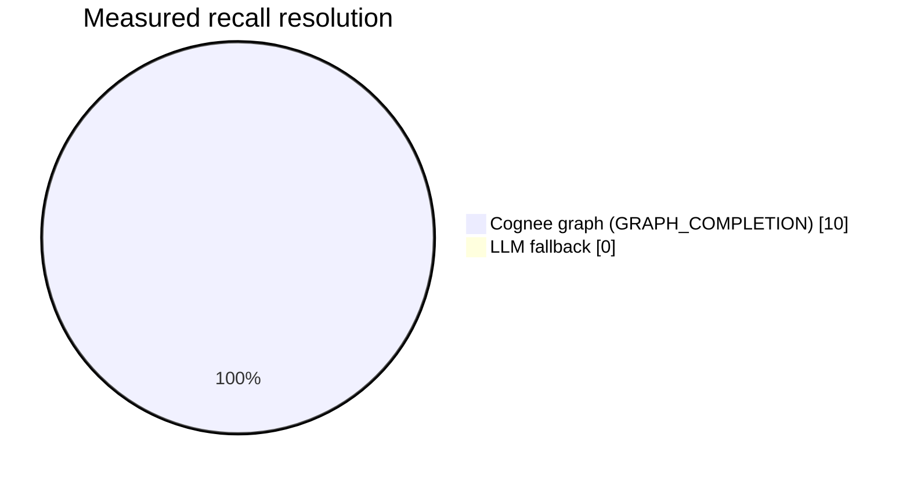

### Measured recall routing

Measured over **10** queries against a populated graph on 2026-07-03:

- Cognee-served: **10/10 (100%)**
- LLM fallback: **0/10 (0%)**

### Measured recall latency

| Metric | End-to-end (client) | Backend (server) |
|---|---|---|
| Average | 11670.4 ms | 11310.4 ms |
| Median (p50) | 8437.2 ms | 7999.1 ms |
| p95 | 26454.9 ms | 26147.0 ms |
| Min / Max | 7825.7 / 40140.3 ms | - |

| Query | Provider | Model |
|---|---|---|
| Who is the groom and when is the wedding? | cognee | graph-completion |
| What database do we use now? | cognee | graph-completion |
| What database did we use before? | cognee | graph-completion |
| What changed about our deploy process? | cognee | graph-completion |
| What does Engram use for its memory lifecycle? | cognee | graph-completion |
| Is Stu the groom? | cognee | graph-completion |
| When did we switch database? | cognee | graph-completion |
| Summarize the current architecture decisions. | cognee | graph-completion |
| What is the wedding location? | cognee | graph-completion |
| Which memory operations does Cognee provide? | cognee | graph-completion |
